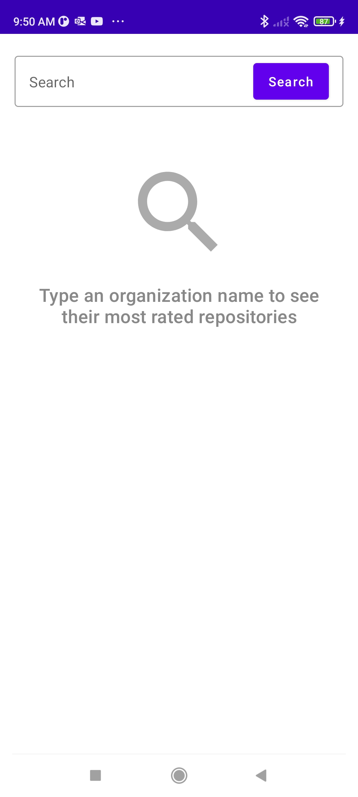
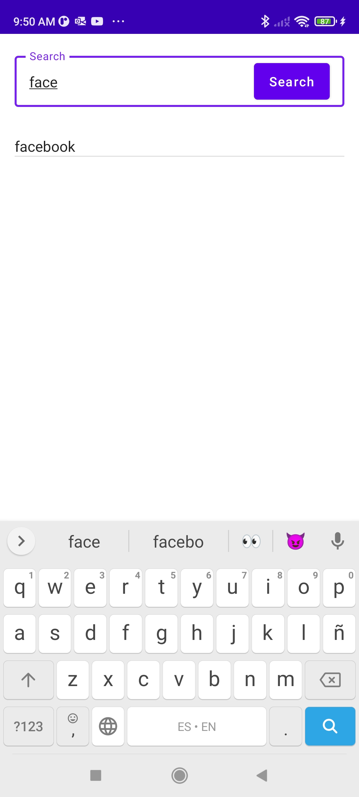
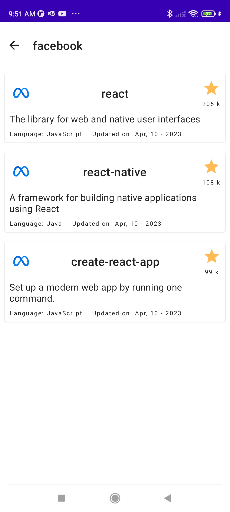
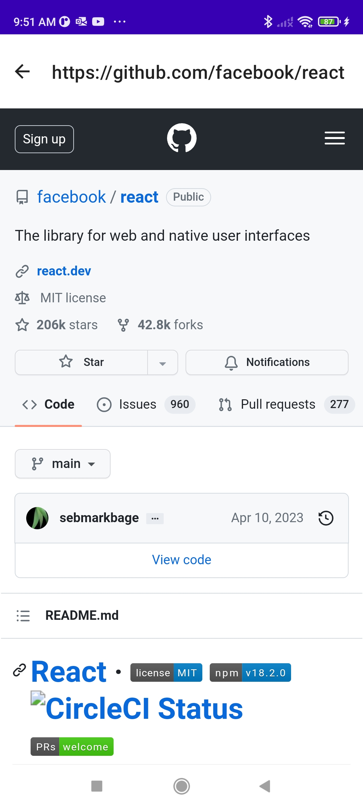
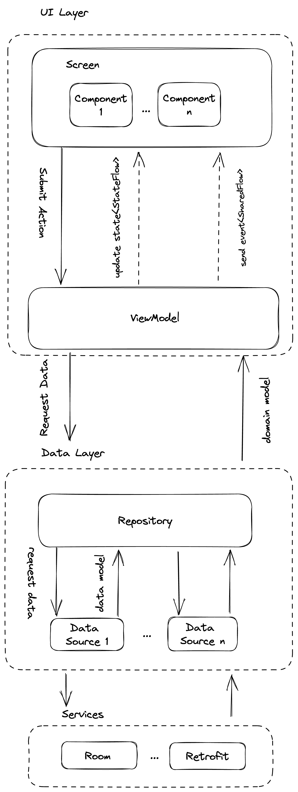

# Github Repository
This app allows the user to search for the top 3 most popular Github repositories (by stars) in an organization.

The app has a Search Screen where the user can type the organization name, and when the user taps search button,
it navigates to a Repositories Screen. Repositories Screen shows top 3 repositories rated by stars for the
given organization. In case there is no repository, or the organization is not found, the user will see 
an error. If the user taps in a repository from the list, the app will navigate to a WebView, showing 
the actual repository on Github.

The app has been developed using Kotlin, Jetpack Compose, Hilt, Room, Retrofit, Android Jetpack and other frameworks necessary to complete the features.

NOTE: Tha app uses the [Github API](https://docs.github.com/en/rest/repos/repos?apiVersion=2022-11-28)
to get the repositories. The endpoint used is [search/repository](https://docs.github.com/en/rest/search?apiVersion=2022-11-28#search-repositories),
there is an [/orgs/{org}/repos](https://docs.github.com/en/rest/repos/repos?apiVersion=2022-11-28#list-organization-repositories), 
but it doesn't allow to sort the repositories by stars count.

## Features:
- Search: The User types a word, if the current type value is cached (matches with the first n characters of any value saved in local Room Database), a list with previous organizations matching the pattern will show up. If the user selects an item from the list, or taps search button in the keyboard or the text input, the user will navigate to Repositories Screen.
- Repositories: Repositories Screen requests top 3 most popular repositories from [Github API](https://docs.github.com/en/rest/repos/repos?apiVersion=2022-11-28). If response is error or is any failure (e.g:internet error), the app will show an error screen. Else, the app will cache (save in Room DB) the current organization (if it doesn't exists already) for future searches and display a list with the repositories and some details of those.
- WebView: When the user taps a repository, the app navigates to the WebViewScreen, there is a WebView showing the Github page for the selected repository.

## Screens
Splash Screen:

Search Screen:

Repositories Screen

Repository Details

## Modularization
The app is Modularized. Theres is a module for each feature (except Web View, it's too small yet).
Each feature module has 2 submodules: UI (containing Screens, Components and ViewModel) and Data(containing Repositories and DataSource).
There's also a core Module with 3 submodules (db, ui and data), containing common features for the whole app.
Navigation Module contains the Navigation (Compose Navigation) implementation in the app.

## Architectural overview
The app implements and MVI architecture. The View (Screen) submits actions to the ViewModel, and the 
ViewModel (with Data Layer Help) updates the State For the view and send one-time events (e.g: navigate).
The Features are divided in 2 main Layers: UI and Data.

### Data Layer
Data Layer gets the value from the services (Local Storage, REST API, etc), process this data and sends
DomainModels to The ViewModel.

### UI Layer
UI Layer has a ViewModel That holds and update the uiState (StateFlow) and emits events to the Screen using
Effects (SharedFlow). The Screen submits an action to the ViewModel, then the ViewModel processes the
data and updates the Screen State or emits an event (or could do both). The Screen only shows the current
state and interacts with the Android Framework

## Testing
Data Layer and ViewModels are 100% Unit Tested on each module. There aren't Integration Tests, except
for core-db, where it's necessary to mock the local DataBase. To mock the backend has been used
[Mock Web Server](https://github.com/square/okhttp/tree/master/mockwebserver), and to mock all the
remaining data there has been created either Fake Objects or mock objects using [Mockito](https://site.mockito.org/).
To Unit Test the StateFlows and SharedFlows has been used [Turbine Library](https://github.com/cashapp/turbine).